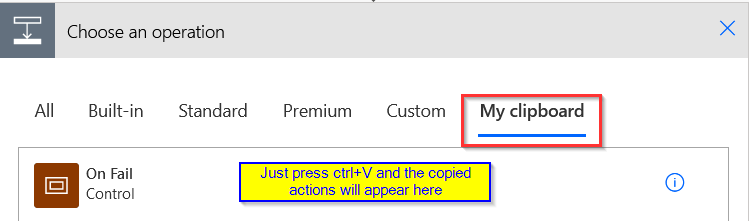

# Power Automate code snippet repository
This repository contains snippets of code (sorry, JSON) that I use frequently in Power Automate actions. The code can be copied and then be transformed into Power Automate actions by just pressing ctrl+V while in the "From clipboard" section of the "New step" dialog.



## Initialize strErrorDetails
[Link to JSON](https://github.com/OliverR-82/PowerAutomate/blob/main/Initialize%20strErrorDetails)

This action initializes a string variable with the name "strErrorDetails". This is used in the ["On fail" scope](https://github.com/OliverR-82/PowerAutomate/blob/main/Scope%20On%20Fail).

## Scope On Fail
[Link to JSON](https://github.com/OliverR-82/PowerAutomate/blob/main/Scope%20On%20Fail)

This scope is useful for sending error notifications. It captures error information and sends it in an e-mail with a direct link to the run history. **Note that this does not do any error _handling_, it just sends you an immediate notification with useful information.**

**Some things to point out:**
* It assumes that you have a scope called "Main" before it where all your logic happens. If the preceding scope has a different name, you should modify the expression used in the "From" property of the "Filter errors" action to include your scope name. Note that any spaces in your scope's name should be replaced with underscores.
```
result('Main')
```
* The "Run after" settings of the scope should be set to "has failed" and "has timed out". 
* If you're using *multiple* scopes before this one, the "Run after" settings should also include "is skipped".
* Also if you're using multiple scopes before this one, you should modify the expression in the "From" property of the "Filter errors" action to include the other scopes. You can do this using the union() expression.
```
union(result('First_scope'),result('Second_scope'),result('Another_scope'))
```
* For conditions, switch cases and loops, by default it will just give you the error of the parent action that failed (almost always something like "no dependent actions succeeded") instead of giving you the information of the underlying (ie. nested) action that actually failed. To get more detailed error information of any actions that are nested in conditions, switch cases or loop actions, you should - again - modify the expression in the "From" property of the "Filter errors" action to include these actions.
```
union(result('Main_scope'),result('Condition_in_main_scope'),result('Apply_to_each_in_main_scope'))
```
* Errors aren't always returned in the exact same structure in Power Automate. This scope uses the coalesce() function to get the error *message* if it exists, and the error *code* if it does not. More precisely it attempts to get the error *message* from the following structures:
  - `item()?['error']?['message']`
  - `item()?['outputs']?['body']?['message']`
  - `item()?['outputs']?['body']?['error']?['message']`

If none of the above properties exist, then it will just use `item()['code']`.
* The "Notify of flow failure" action (which sends out the e-mail) has the "Run after" configured to run **always**. This is to ensure that even if the preceding actions - the ones that filter the results and collect the error information - fail, that an e-mail will _still_ be sent out. The e-mail may then not contain (all) the error information, but it will still contain a direct link to the run history and more importantly you will still get notified of an error, which is the whole point of this scope.
